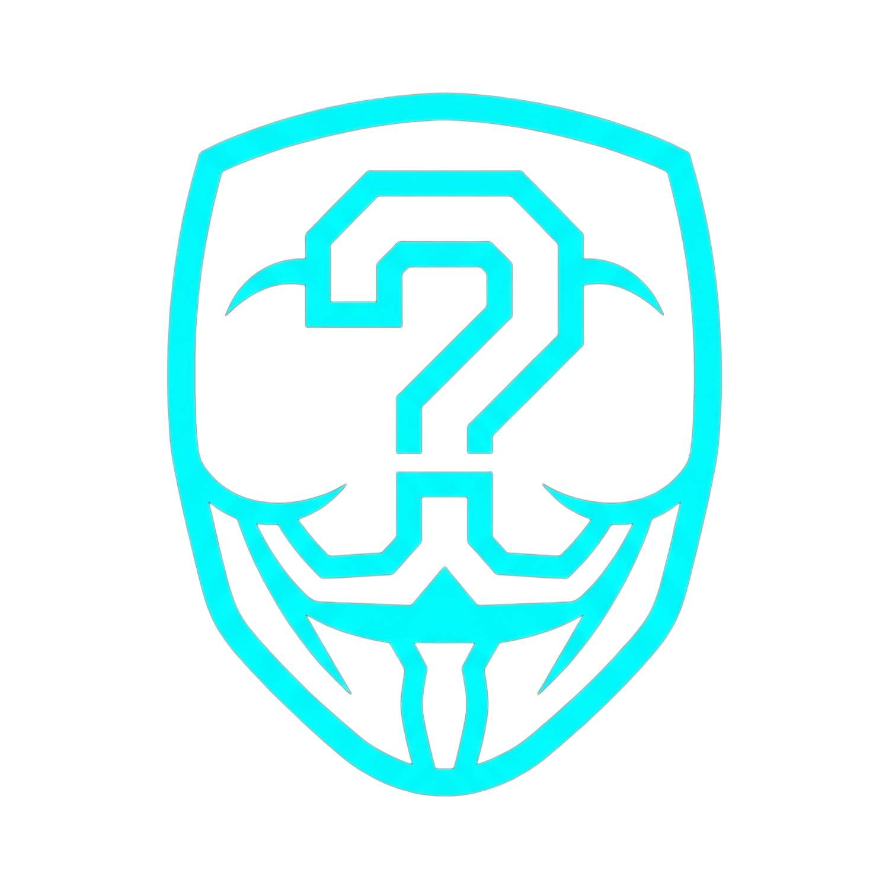
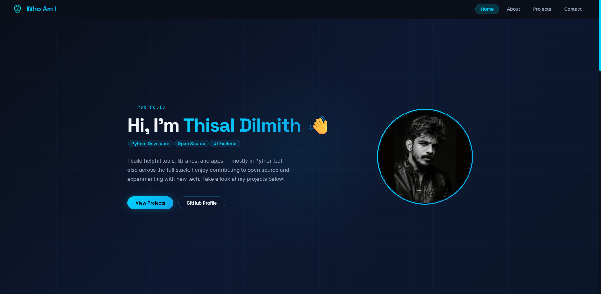

<div align="center">
  
  <h1>Thisal Dilmith – Personal Portfolio</h1>
  <p>
    <strong>Here</strong> is a personal portfolio website built with React, designed to showcase my open-source projects, skills, and online presence. This project serves as a digital identity — a place where others can learn more about who I am, what I’ve built, and where to find me online.
  </p>
  <p>
    <i>🧠 “Not just a portfolio — it's a reflection of the journey so far.”</i>
  </p>
</div>

---

## 🚀 Live Demo

Experience the portfolio in action:
👉 **[Thisal Dilmith - Live Site](https://thisal-dilmith.pages.dev/)**

---

## 📸 Sneak Peek

<div align="center">
  
</div>

---

## 🛠️ Tech Stack

<div align="center">
  
  
  
  
</div>

---

## 🧑‍💻 Setup Instructions

Want to run this project locally? Follow these simple steps:

### 1. Clone the repository

```bash
git clone https://github.com/thisal-d/who-am-i.git
cd who-am-i
```

### 2. Install dependencies

```bash
npm install
```

### 3. Start the development server

```bash
npm run dev
```

### 4. Build for production

```bash
npm run build
```

---

## 💬 Feedback & Contributions

Got an idea or found a bug? I'd love to hear from you! 
Feel free to [open an issue](https://github.com/thisal-d/who-am-i/issues) or submit a pull request. Every bit of feedback helps me grow.

---

## 🙌 Acknowledgments

A huge thank you to the open-source community for providing the tools and inspiration that make building projects like this possible. Keep creating! ✨

<br/>

<div align="center">
  <i>Built with ❤️ by <a href="https://github.com/thisal-d">thisal-d</a></i>
</div>
